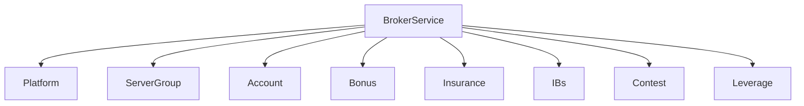

# Broker Service

El servicio de broker es el encargado de la gestion de cuentas de trading relacionadas al modelo de negocio de Broker (intermediario).

# Features
- Platform (Configuracion de acceso al `TradingService`) `en marcha`
- ServerGroup `pendniente`
- Account `pendiente`
- Bonus `pendinente`
- Insurance `pendiente`
- IBs `pendiente`
- Contest
- Leverage `pendiente`

